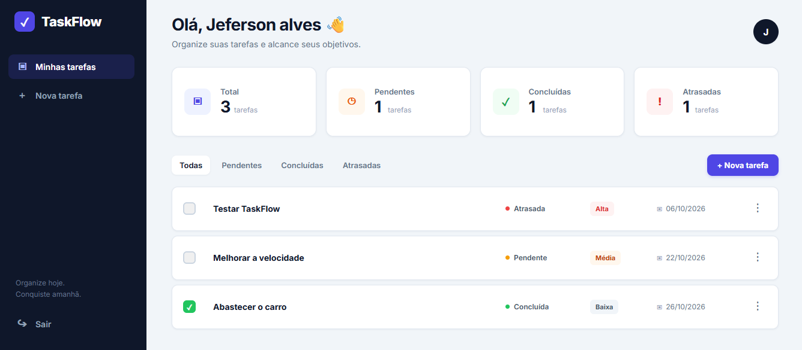
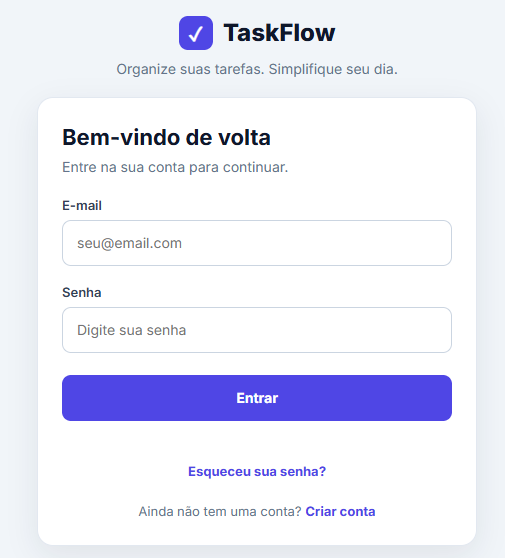
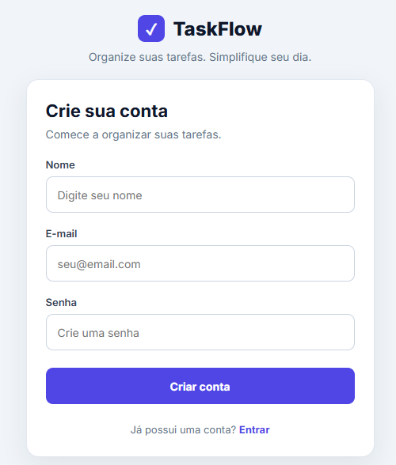

# ✅ TaskFlow — Gerenciador de Tarefas

O **TaskFlow** é uma aplicação web de gerenciamento de tarefas desenvolvida com Python, Flask e PostgreSQL.

O projeto permite que cada usuário organize suas atividades, acompanhe prazos e prioridades e gerencie suas tarefas em uma interface simples, responsiva e intuitiva.

🔗 **[Acessar o TaskFlow](https://taskflow-5g4z.onrender.com)**

## 🚀 Funcionalidades

- Cadastro e autenticação de usuários
- Senhas armazenadas com hash seguro
- Recuperação de senha por e-mail
- Criação, edição e exclusão de tarefas
- Marcação de tarefas como concluídas ou pendentes
- Prioridades baixa, média e alta
- Definição de prazos
- Identificação de tarefas atrasadas
- Filtros por status das tarefas
- Painel com contadores de tarefas
- Separação dos dados por usuário
- Interface responsiva

## 🔐 Segurança

- Proteção CSRF nos formulários
- Consultas SQL parametrizadas
- Limitação de tentativas de login e recuperação de senha
- Cookies de sessão configurados com `Secure`, `HttpOnly` e `SameSite`
- Expiração da sessão após 30 minutos de inatividade
- Tokens temporários para recuperação de senha
- Credenciais e configurações sensíveis por variáveis de ambiente

## 🛠️ Tecnologias utilizadas

- **Backend:** Python e Flask
- **Frontend:** HTML, CSS e JavaScript
- **Banco de dados:** PostgreSQL
- **Autenticação:** Werkzeug e sessões do Flask
- **Segurança:** Flask-WTF e Flask-Limiter
- **E-mail transacional:** API Brevo
- **Hospedagem:** Render
- **Banco de dados em nuvem:** Supabase
- **Versionamento:** Git e GitHub

## 💻 Executando localmente

**1. Clone o repositório**

```bash
git clone https://github.com/JefersonAlvers/TaskFlow.git
cd TaskFlow
```

**2. Instale as dependências**

```bash
pip install -r requirements.txt
```

**3. Configure as variáveis de ambiente**

Crie um arquivo `.env` na raiz do projeto:

```env
SECRET_KEY=sua_chave_secreta
DATABASE_URL=sua_url_postgresql
BREVO_API_KEY=sua_chave_da_brevo
```

Nunca publique o arquivo `.env` com credenciais reais.

**4. Execute a aplicação**

```bash
python app.py
```

Acesse `http://127.0.0.1:5000` no navegador.

**Observação:** como os cookies estão configurados com `Secure`, a autenticação completa exige HTTPS. Para desenvolvimento local, essa configuração pode ser adaptada ao ambiente.

## 📷 Capturas de tela

### Painel de tarefas


### Tela de login


### Tela de cadastro


## 📌 Sobre o projeto

O TaskFlow foi desenvolvido como projeto de portfólio, com o objetivo de aplicar conhecimentos de desenvolvimento web full stack, autenticação, persistência de dados, segurança e implantação de aplicações em nuvem.

O sistema utiliza PostgreSQL para armazenar os dados e permite que diferentes usuários gerenciem suas próprias tarefas.

## 👨‍💻 Desenvolvedor

Desenvolvido por **Jeferson Alves de Abreu**.

[GitHub](https://github.com/JefersonAlvers)